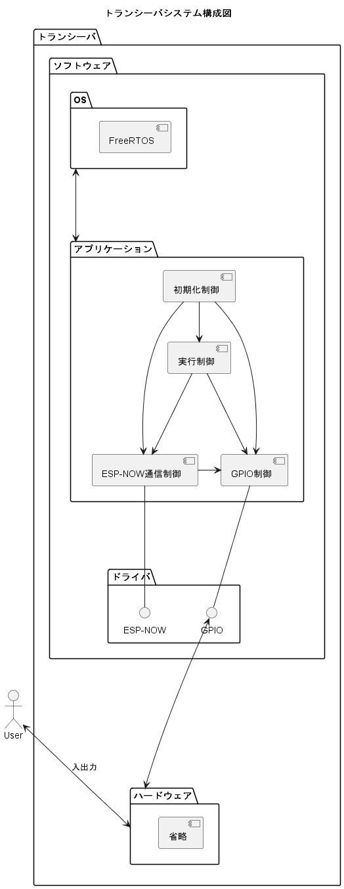

# トランスシーバPhase-1システム要求仕様書

## 目次
- [1. 概要](#1-概要)
- [2. 用語定義](#2-用語定義)
- [3. システム概要](#3-システム概要)
- [4. 機能要求](#4-機能要求)
  - [4.1 通信制御](#41-通信制御)
  - [4.2 ~~音声入力制御~~](#42-音声入力制御)
  - [4.3 ~~音声出力制御~~](#43-音声出力制御)
  - [4.4 実行制御](#44-実行制御)
  - [4.5 初期化制御](#45-初期化制御)
  - [4.6 タスク起動手順(設計書転載予定)](#46-タスク起動手順設計書転載予定)
- [5. 非機能要求](#5-非機能要求)
  - [5.1 性能](#51-性能)
  - [5.2 信頼性](#52-信頼性)
  - [5.3 保守性](#53-保守性)
- [6. インターフェース仕様](#6-インターフェース仕様)
  - [6.1 ハードウェアインターフェース](#61-ハードウェアインターフェース)
  - [6.2 ソフトウェアインターフェース](#62-ソフトウェアインターフェース)
    - [6.2.1 ESP-NOW](#621-ESP-NOW)  
    -   [6.2.1.1 トランシーバ1↔トランシーバ2間の通信](#6211-トランシーバ1トランシーバ2間の通信)    
- [7. 制約条件](#7-制約条件)
- [8. テスト項目（概要）](#8-テスト項目概要)
- [9. 変更履歴](#9-変更履歴)

---

## 1. 概要
- **プロジェクト名**: トランシーバ
- **作成日**: 2025/9/14
- **作成者**: 西澤
- **対象デバイス**: ESP32
- **目的**: 本仕様書は、トランスシーバプロジェクトPhase-1における組み込みシステムの要求事項を明確にすることを目的とする。

---

## 2. 用語定義
| 用語      | 定義             |
| ------- | -------------- |
| GPIO    | 汎用入出力ピン        |
| UART    | シリアル通信方式の一種    |
| ESP32   | Espressifが開発したマイクロコントローラ   |
| ESP-NOW |Espressifが開発した独自の無線通信プロトコル|
| LED |「Light Emitting Diode」発光ダイオード |

---

## 3. システム概要
- システムアーキテクチャ
  - **構成図**: 
- **主な機能**:
  - 通信制御
    - GPIO通信
    - シリアル通信(デバッグ用)
    - ESP-NOW通信
  - ~~音声入力制御~~
  - ~~音声出力制御~~
  - 実行制御
    - 初期化処理制御

---

## 4. 機能要求

### 4.1 通信制御
- ***COMM_001***: 起動時に通信チャンネル(1~14)を設定する
- ~~***COMM_002***: 100m以上の通信を行えるものとする(ハードウェア仕様書に転載する)~~
- ***COMM_002**: ESP-NOWを使用したブロードキャストの送受信通信を実現する
- ***COMM_003**: (送信側)スイッチを押し続けている間[6.2.1.1 トランシーバ1↔トランシーバ2間の通信](#6211-トランシーバ1トランシーバ2間の通信)のデータを送信する
- ***COMM_004***: (受信側)受信したデータを解析し以下の動作を行う
- ***COMM_005***: LED点灯指令がONの場合gpioにhighを書き込む
- ***COMM_006***: 押しボタンスイッチのGPIOピンのデータを格納する
### 4.2 ~~音声入力制御~~
- 今回Phaseでは使用しない

### 4.3 ~~音声出力制御~~
- 今回Phaseでは使用しない

### 4.4 実行制御
- ***EXE_001***: FreeRTOSを使用し以下のタスクの実行を実現する。

| タスク名    | コア割り当て | タスク周期    | 概要               |
| ------- | ------ | -------- | ---------------- |
| 通信受信タスク | CPU0   | 100Hz    | ESP-NOWでの受信を実施する |
| 通信送信タスク | CPU0   | 割り込みイベント | ESP-NOWでの受信を実施する |
| 実行制御タスク | CPU1   | 100Hz    | 実行制御を実施する        |
| 初期化タスク  | CPU1   | 100Hz    | スタートアップを実施する。    |

- ***EXE_002***: 100Hzの周期で通信受信タスクを実行する。
- ***EXE_003***: GPIOよりLED点灯指令を取得し、ONの場合、通信送信タスクを割り込み実行する。
- ***EXE_005***: タスクカウンタを監視し、5周期動作を確認できなかった場合、タスク異常とする。

### 4.5 初期化制御
- ***INI_001***: Main.inoから呼び出され起動時の初期化を実行する。

### 4.6 タスク起動手順(設計書転載予定)
- Main.inoをスタートアップで起動する。
- setup関数で各サブシステムのファサードのインスタンス生成を行い、クラス同士のアドレスの紐付けを行う。
- 各ファサードクラスにてタスクのリジュームを行う
- loop関数で実行制御タスクのセマフォを100Hz周回で解放する
- 実行制御タスクにて周期で起動するセマフォを解放する
---

## 5. 非機能要求

### 5.1 性能
- 開発環境はESP-IDFとArduino IDEがあるが、可用性の観点からArduino IDEを使用する
- main.ino以外はライブラリとしてzipファイルにする。

### 5.2 信頼性
- トレーサビリティを考慮する。コーティング規約に記載する

### 5.3 保守性
- トレーサビリティを考慮する。詳細はコーティング規約に記載する

---

## 6. インターフェース仕様

### 6.1 ハードウェアインターフェース
 - ハードウェア要求仕様書に記載する

### 6.2 ソフトウェアインターフェース
#### 6.2.1 ESP-NOW通信
##### 6.2.1.1 トランシーバ1トランシーバ2間の通信

| バイト数 | データ名    | 型 | LSB | データ範囲      |     |
| ---- | ------- | --- | --- | ---------- | --- |
| 4    | カウンタ    | UI | -   | 0~longMax  |
| 1    | LED点灯指令 | UC | -   | 0:OFF,1:ON |
| 1    | パリティ    | UC | -   | 常時OFF      |
| 1    | パリティ    | UC | -   | 常時OFF      |
| 1    | パリティ    | UC | -   | 常時OFF      |
---
#### 6.2.2 GPIO通信
#### 6.2.2.1 デジタル入出力

| デバイス      | IN/OUT    | ピン番号   |
| --------- | ------- | ------ |
| LED       | IN | GPIO32 |
| 押しボタンスイッチ | OUT | GPIO12 |
---

## 7. 制約条件
- C/C++(Arduino言語)を使用すること。
- 使用可能なメモリは最大8MB。
- 無線系処理はCPU0で行われるためCPU0を無線以外の処理で使用しないこと。

---

## 8. テスト項目（概要）

- Phease-1テスト法案書に記載する

---

## 9. 変更履歴

| 日付 | 変更内容 | 変更者 |
|------|----------|--------|
| 2025/9/15 | 初版作成 | 西澤 |

